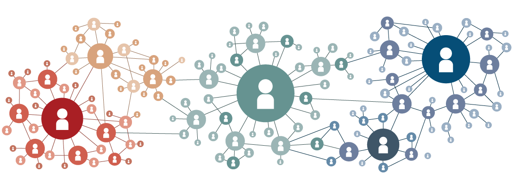

<!-- Add banner here -->

# Social Network Analysis (SNA)
<!-- Add buttons here -->

<!-- Describe your project in brief -->
In this project, we perform social network analysis on Facebook friend data to 
understand the pattern of our Facebook network.

# Table of contents
- [Description](#Description)
- [Dataset](#Dataset)
- [Analysis](#Analysis)
- [Conclusion](#Conclusion)

## Description
In this social network analysis, we first preprocess the data after collecting it from 
Facebook. To get an insight into the network, we perform descriptive analysis
such as average degree, size, degree distribution, average clustering coefficient.
We also perform structural analysis such as centralities of a network (i.e., Degree
Centrality, Closeness Centrality, Betweenness Centrality, Eigen-vector Centrality).
Finally, we perform Community Detection using Louvain Heuristics to understand
the pattern in our Facebook friends network.

## Dataset
At the time of this project, Facebook does not offer any APIs to collect the friend's data. 
So, we collect the data of our Facebook friends using 
Selenium Framework (i.e., popularly known for automation web testing). 
Collecting the data using this approach is quite a time taken because Facebook
allows a limited number of user actions at a time.

## Analysis

### 1. Descriptive Statistics of my Social Network and Random Graphs.

### 2. Structural Analysis of SN

### 3. Community Detection using Louvain Heuristics
Gray Community includes friends from my 
Orange Community includes friends from my hometown
Green Community includes friends from school who are connected to 
'Orange Community' because my school was in my hometown.
Light and Sky blue Communities includes friends from my University in which
Light Blue Community consists 'Faculty of CS & IT' friends and Sky blue 
The community consists of other faculties friends. That's why there is strong 
connectivity between these two communities.

## Conclusion
In this project, we performed social network analysis on facebook friends network
to understand the pattern between different communities in a network.

